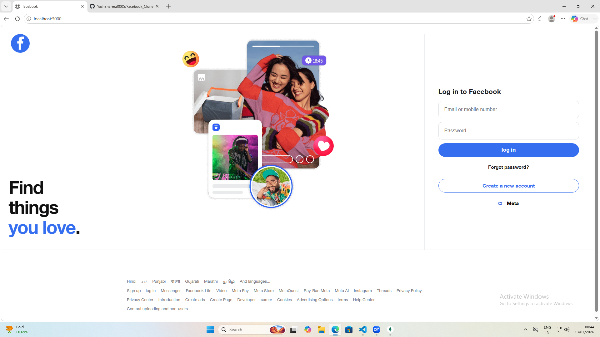
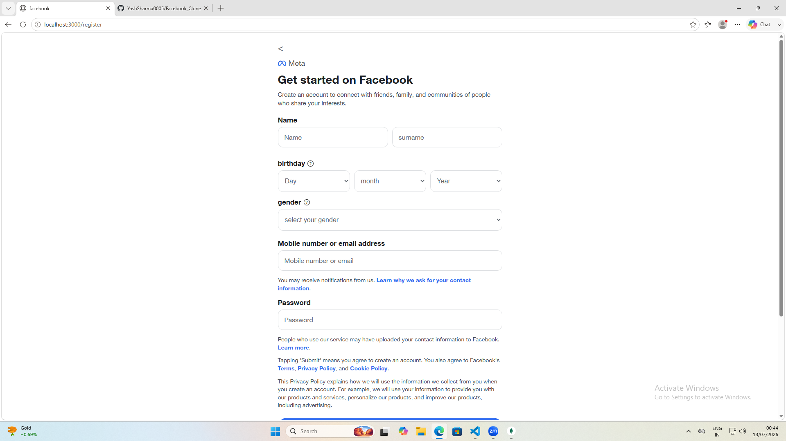

# Facebook-Style Login & Registration (MERN)

A full-stack Facebook-inspired authentication application built using the **MERN Stack (MongoDB, Express, React, and Node.js)**. The project recreates Facebook's login and registration experience while implementing secure authentication using JWT and bcrypt.

---

## 🚀 Features

* User Registration with:

  * First Name
  * Last Name
  * Email Address
  * Password
  * Birthday
  * Gender
* Secure password hashing using **bcrypt**
* JWT-based authentication
* Protected routes with automatic redirection
* Duplicate email validation
* Invalid login error handling
* Responsive Facebook-inspired UI

---

## 🛠️ Tech Stack

### Frontend

* React.js
* Vite
* CSS3

### Backend

* Node.js
* Express.js
* MongoDB
* Mongoose
* JWT Authentication
* bcrypt

---

## 📂 Project Structure

```text
facebook-auth-clone/
│
├── backend/
│   ├── models/
│   ├── routes/
│   ├── controllers/
│   └── server.js
│
├── frontend/
│   ├── src/
│   ├── public/
│   └── vite.config.js
│
└── README.md
```

---

## ⚙️ Installation

### 1. Clone the Repository

```bash
git clone https://github.com/your-username/facebook-auth-clone.git
cd facebook-auth-clone
```

---

### 2. Backend Setup

```bash
cd backend
npm install
cp .env.example .env
```

Update your `.env` file:

```env
MONGO_URI=your_mongodb_connection_string
JWT_SECRET=your_secret_key
```

Start the backend server:

```bash
npm run dev
```

Backend runs on:

```text
http://localhost:5000
```

---

### 3. Frontend Setup

Open another terminal:

```bash
cd frontend
npm install
npm run dev
```

Frontend runs on:

```text
http://localhost:3000
```

---

## 📄 Application Pages

| Route       | Description                    |
| ----------- | ------------------------------ |
| `/`         | Simple Login Page              |
| `/login`    | Full Facebook-style Login Page |
| `/register` | Registration Page              |
| `/home`     | Protected Home Page            |

---

## 📸 Project Screenshots

### Login Page

<p align="center">
  
</p>

---

### Registration Page

<p align="center">
  
</p>

---

## 🖼️ Adding Your Own Images

Place your images inside:

```text
frontend/src/assets/
```

Then use them like this:

```jsx

```

---

## 🔒 Security Features

* Password Hashing with bcrypt
* JWT Authentication
* Protected Routes
* Authentication Persistence using localStorage

---

## 📌 Future Improvements

* Email Verification
* Refresh Tokens
* Password Reset
* Rate Limiting
* HTTPS Support
* Input Sanitization
* Social Login (Google/Facebook)

---

## 📜 Disclaimer

This project is created for **educational purposes only**. It is not affiliated with, endorsed by, or connected to Meta or Facebook. No official Facebook code or assets are included in this repository.

---

## ⭐ Support

If you like this project, consider giving it a **star ⭐ on GitHub**.
